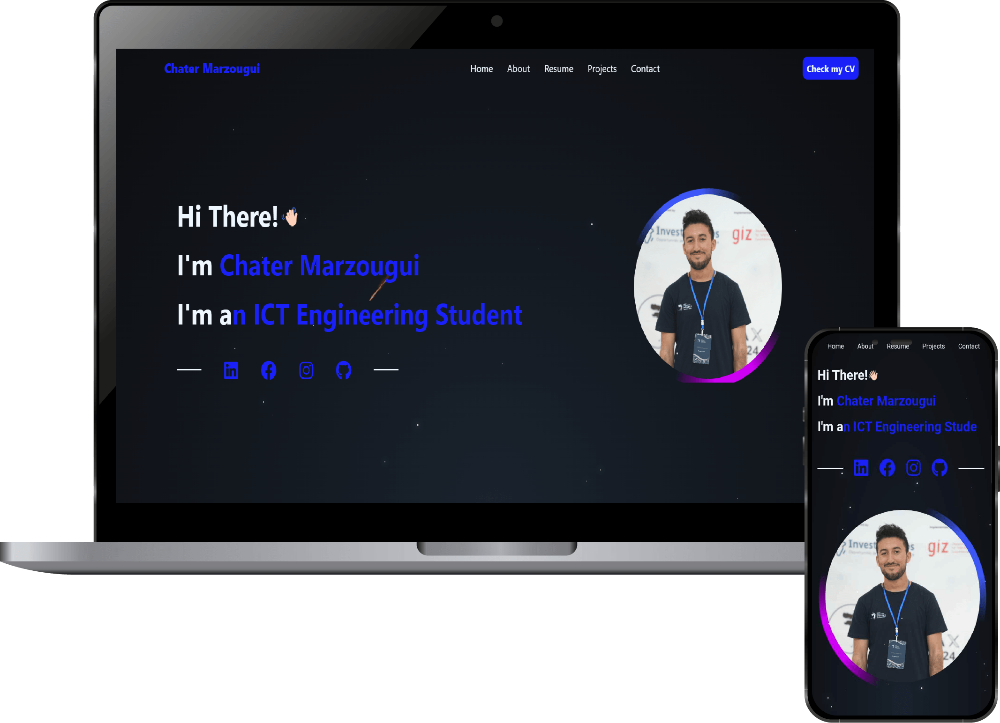

<a name="readme-top"></a>
<div align="center">

[![Contributors][contributors-shield]][contributors-url]
[![Forks][forks-shield]][forks-url]
[![Stargazers][stars-shield]][stars-url]
[![Issues][issues-shield]][issues-url]
[![MIT License][license-shield]][license-url]
[![LinkedIn][linkedin-shield]](https://www.linkedin.com/in/chater-marzougui-342125299/)
</div>


<!-- PROJECT LOGO --> 
<br />
<div align="center">
    <h1 style="font-size:35px">My Portfolio <br><a style="font-size:20px" href="https://chater-marzougui.me/Portfolio/" target="_blank">chater-marzougui.io</a></h1>
    <br>
    <p style="font-size:20px" align="center">
        A showcase of my projects and skills
    <br>
    <br>
    <a href="https://github.com/chater-marzougui/Portfolio/issues/new?labels=bug&template=bug-report---.md">Report Bug</a>
    ·
    <a href="https://github.com/chater-marzougui/Portfolio/issues/new?labels=enhancement&template=feature-request---.md">Request Feature</a>
  </p>
  <br><br>
  <a href="https://github.com/chater-marzougui/Portfolio/">
    
  </a>
</div>


# My Portfolio
<!-- TABLE OF CONTENTS -->
<details>
  <summary>Table of Contents</summary>
  <ol>
    <li><a href="#about-the-project">About The Project</a></li>
    <li><a href="#technologies-used">Technologies Used</a></li>
    <li><a href="#features">Features</a></li>
    <li><a href="#project-highlights">Project Highlights</a></li>
    <li><a href="#installation">Installation</a></li>
    <li><a href="#contributing">Contributing</a></li>
    <li><a href="#license">License</a></li>
    <li><a href="#contact">Contact</a></li>
  </ol>
</details>


<!-- ABOUT THE PROJECT -->
## About The Project
This **Portfolio** is a comprehensive personal website designed to showcase my journey as an ICT engineering student with a passion for developing innovative solutions and exploring cutting-edge technologies. The platform serves as a digital showcase of my expertise in **Robotics** and **Software Development**, with a particular focus on web and mobile platforms.

The portfolio features an interactive and visually appealing design, including a stunning starry sky effect, smooth animations, and a responsive layout that works seamlessly across all devices. It's built from scratch using modern web technologies and showcases over 10 major projects spanning various domains including AI applications, mobile development, embedded systems, and web development.

## Technologies Used
- **Frontend:** HTML5, CSS3, JavaScript (ES6+)
- **Styling:** Custom CSS with advanced animations and responsive design
- **Data Management:** JSON-based project and skills data structure
- **APIs:** GitHub API for contribution graphs, Gemini AI API integration (in featured projects)
- **Deployment:** GitHub Pages with automated CI/CD
- **Version Control:** Git & GitHub with proper workflow management

## Features
- **Responsive Design:** Fully responsive layout that works flawlessly on all device sizes and orientations
- **Interactive Animations:** Engaging CSS animations and transitions for enhanced user experience
- **Dynamic Project Showcase:** JSON-driven project cards with detailed descriptions, technologies, and live/repository links
- **Skills Visualization:** Interactive skill set display with categorized professional skills and tools
- **Contact Form:** Functional contact form with client-side validation
- **Starry Sky Effect:** Custom-built animated starry background with floating asteroids
- **GitHub Integration:** Live GitHub contribution graph display via API
- **SEO Optimized:** Proper meta tags, Open Graph protocol, and semantic HTML structure
- **Performance Optimized:** Efficient loading with optimized assets and minimal dependencies
- **Dynamic Content Loading:** JavaScript-powered dynamic content population from JSON data sources

<br/>

<div align="right">
  <a href="#readme-top">
    
  </a>
</div>

## Project Highlights
This portfolio showcases a diverse range of projects demonstrating expertise across multiple technology stacks:

### 🚀 **Featured Projects**
- **🏠 Samsar:** Flutter-based real estate app for the Tunisian market with Firebase integration and interactive mapping
- **🎵 MoodMuse:** AI-powered mood analysis app using camera input and machine learning for personalized music recommendations  
- **🤖 RC Car Controller:** Flutter app with Arduino integration for remote control via HTTP communication and gyroscope control
- **🧠 Education Help Gemini:** AI-powered study assistant with document processing and interactive learning features
- **⚡ PV Performance Simulation:** Real-time photovoltaic panel simulation using MATLAB/Simulink with STM32 PIL testing
- **🛠️ Chater CLI Tools:** Comprehensive PowerShell toolkit with 16 automation scripts for developer workflow enhancement

### 🌐 **Live Applications**
- [IndabaX Tunisia 2024](https://www.indabaxtunisia.com/2024/) - Professional event website
- [Skill Issue Check](https://chater-marzougui.me/Skill-Issue-Check/) - AI-powered document analysis tool
- [Education Help Gemini](https://chater-marzougui.me/Education-Help-Gemini/) - Interactive learning assistant

<div align="right">
  <a href="#readme-top">
    
  </a>
</div>

## Installation

### Quick Start (Recommended)
🌐 **Live Demo:** <a style="font-size:16px" href="https://chater-marzougui.me/Portfolio/" target="_blank">chater-marzougui.io</a>

### Local Development Setup
1. **Clone this repository** to your local machine:
   ```bash
   git clone https://github.com/chater-marzougui/Portfolio.git
   ```

2. **Navigate to the project directory**:
   ```bash
   cd Portfolio
   ```

3. **Open `index.html`** in your preferred web browser:
   - **Option A:** Double-click the `index.html` file
   - **Option B:** Use a local server (recommended for full functionality):
     ```bash
     # Using Python
     python -m http.server 8000
     
     # Using Node.js
     npx http-server
     
     # Using Live Server (VS Code extension)
     # Right-click index.html → "Open with Live Server"
     ```

4. **Access the portfolio** at `http://localhost:8000` (if using local server)

### 📁 Project Structure
```
Portfolio/
├── index.html              # Main HTML file
├── assets/
│   ├── css/               # Stylesheets
│   ├── js/                # JavaScript files
│   ├── images/            # Images and icons
│   ├── json/           # JSON data files
│   └── CV_Chater_Marzougui.pdf
└── README.MD              # This file
```

<div align="right">
  <a href="#readme-top">
    
  </a>
</div>

## Contributing

Contributions are what make the open source community such an amazing place to learn, inspire, and create. Any contributions you make are **greatly appreciated**.

If you have a suggestion that would make this better, please fork the repo and create a pull request. You can also simply open an issue with the tag "enhancement".
Don't forget to give the project a star! Thanks again!

1. Fork the Project
2. Create your Feature Branch (`git checkout -b feature/AmazingFeature`)
3. Commit your Changes (`git commit -m 'Add some AmazingFeature'`)
4. Push to the Branch (`git push origin feature/AmazingFeature`)
5. Open a Pull Request

<div align="right">
  <a href="#readme-top">
    
  </a>
</div>

## License

This project is licensed under the **MIT License** - see the [LICENSE](LICENSE) file for details.

<!-- CONTACT -->
## Contact

**Chater Marzougui** - ICT Engineering Student  
🎓 **Institution:** Sup'Com (Higher School of Communications of Tunis)  
🌍 **Location:** El Ghazela, Ariana, Tunisia  
📧 **Email:** chater.mrezgui2002@gmail.com  
📱 **Phone:** +216 28 356 927  

### Connect with me:
[![LinkedIn][linkedin-shield]](https://www.linkedin.com/in/chater-marzougui-342125299/) 
[](https://github.com/chater-marzougui)
[](https://www.facebook.com/profile.php?id=100011887802388)
[](https://www.instagram.com/chater.mrezgui/)

**Portfolio Website:** [chater-marzougui.io](https://chater-marzougui.me/Portfolio/)

<br/>

<div align="right">
  <a href="#readme-top">
    
  </a>
</div>

<!-- MARKDOWN LINKS & IMAGES -->
<!-- https://www.markdownguide.org/basic-syntax/#reference-style-links -->
[contributors-shield]: https://img.shields.io/github/contributors/chater-marzougui/Portfolio.svg?style=for-the-badge
[contributors-url]: https://github.com/chater-marzougui/Portfolio/graphs/contributors
[forks-shield]: https://img.shields.io/github/forks/chater-marzougui/Portfolio.svg?style=for-the-badge
[forks-url]: https://github.com/chater-marzougui/Portfolio/network/members
[stars-shield]: https://img.shields.io/github/stars/chater-marzougui/Portfolio.svg?style=for-the-badge
[stars-url]: https://github.com/chater-marzougui/Portfolio/stargazers
[issues-shield]: https://img.shields.io/github/issues/chater-marzougui/Portfolio.svg?style=for-the-badge
[issues-url]: https://github.com/chater-marzougui/Portfolio/issues
[license-shield]: https://img.shields.io/github/license/chater-marzougui/Portfolio.svg?style=for-the-badge
[license-url]: https://github.com/chater-marzougui/Portfolio/blob/master/LICENSE.txt
[linkedin-shield]: https://img.shields.io/badge/-LinkedIn-black.svg?style=for-the-badge&logo=linkedin&colorB=555
[linkedin-url]: https://linkedin.com/in/chater-marzougui-342125299
